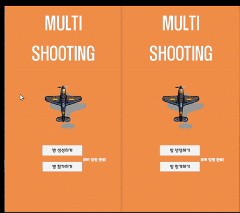
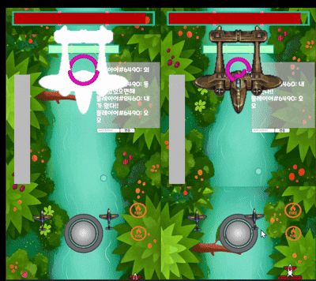
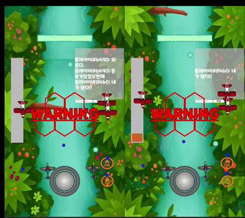

<!-- 기술 배지 -->

# Unity 멀티 슈팅 게임 (PUN2 기반 2D 게임)

## ■ 개요
- Photon PUN2 네트워크 환경에서 동작하는 멀티 슈팅 게임입니다.
- 최대 2명이 같은 방에 접속해 동시에 플레이할 수 있으며,
  실시간 채팅이 되는 슈팅 게임입니다. 
- **Unity / C# / Photon PUN2 기반으로 제작한 개인 프로젝트입니다.**

## ■ 개발 환경
- 언어: C#
- 개발 도구: Unity 2025, Visual Studio 2022
- 네트워크 : Photon PUN2

## ■ 시연 영상
- [Multi Shooting 시연 영상](https://youtu.be/d7c2HUZ4O4U)

## ■ 프로젝트 구조 및 주요 소스코드
<pre>
📂 <b>Assets</b>
├── 📂 <b>Script</b>
│   ├── 📂 <b>LogoScene</b>
│   │   ├── <a href="./Assets/Script/LogoScene/NetworkManager.cs">NetworkManager.cs</a> (방 생성/참가 및 네트워크 초기화 핵심 로직)
│   │   └── <a href="./Assets/Script/LogoScene/SceneTransitionManager.cs">SceneTransitionManager.cs</a> (씬 전환 수행 및 카메라 암막 연출 호출)
│   ├── 📂 <b>SelectScene</b>
│   │   └── <a href="./Assets/Script/SelectScene/CharacterSelector.cs">CharacterSelector.cs</a> (캐릭터 선택 및 데이터 동기화)
│   └── 📂 <b>GameScene</b>
│       ├── <a href="./Assets/Script/GameScene/ChatManager.cs">ChatManager.cs</a> (RPC 기반 실시간 채팅 시스템)
│       ├── <a href="./Assets/Script/GameScene/DamageText.cs">DamageText.cs</a> (데미지 수치 UI 연출)
│       ├── <a href="./Assets/Script/GameScene/GameSceneInitializer.cs">GameSceneInitializer.cs</a> (게임 씬 초기 설정)
│       ├── <a href="./Assets/Script/GameScene/GameSceneManager.cs">GameSceneManager.cs</a> (게임 씬 흐름 관리)
│       ├── <a href="./Assets/Script/GameScene/MonsterManager.cs">MonsterManager.cs</a> (몬스터 그룹 관리)
│       ├── <a href="./Assets/Script/GameScene/MonsterSpawner.cs">MonsterSpawner.cs</a> (몬스터 생성 관리)
│       └── <a href="./Assets/Script/GameScene/PunObjectPool.cs">PunObjectPool.cs</a> (Photon 환경 오브젝트 풀링)
└── 📂 <b>Resources</b>
    ├── 📂 <b>Boss</b>
    │   ├── <a href="./Assets/Resources/Boss/BossAttack.cs">BossAttack.cs</a> (3단 탄막 패턴 로직)
    │   ├── <a href="./Assets/Resources/Boss/BossBullet.cs">BossBullet.cs</a> (보스 전용 투사체)
    │   ├── <a href="./Assets/Resources/Boss/BossController.cs">BossController.cs</a> (보스 메인 AI 컨트롤러)
    │   ├── <a href="./Assets/Resources/Boss/BossHealth.cs">BossHealth.cs</a> (보스 HP 및 동기화)
    │   └── <a href="./Assets/Resources/Boss/BossMovement.cs">BossMovement.cs</a> (보스 이동 패턴)
    ├── 📂 <b>Item</b>
    │   ├── <a href="./Assets/Resources/Item/Item.cs">Item.cs</a> (아이템 습득 및 효과 적용)
    │   └── <a href="./Assets/Resources/Item/ItemManager.cs">ItemManager.cs</a> (아이템 드랍 및 관리)
    ├── 📂 <b>Monster</b>
    │   ├── <a href="./Assets/Resources/Monster/MonsterBullet.cs">MonsterBullet.cs</a> (몬스터 전용 총알)
    │   └── <a href="./Assets/Resources/Monster/MonsterController.cs">MonsterController.cs</a> (일반 몬스터 AI)
    ├── <a href="./Assets/Resources/BandLaser.cs">BandLaser.cs</a> ( 레이저 공격 패턴 )
    ├── <a href="./Assets/Resources/Bullet.cs">Bullet.cs</a> (기본 탄환 로직)
    ├── <a href="./Assets/Resources/LaserController.cs">LaserController.cs</a> (궁극기 발사 시퀀스 제어)
    ├── <a href="./Assets/Resources/PlayerController.cs">PlayerController.cs</a> (플레이어 조작 및 동기화)
    └── <a href="./Assets/Resources/PlayerHealth.cs">PlayerHealth.cs</a> (플레이어 체력 시스템)
</pre>
---

## ■ 주요 구현 기능

### 1. 네트워크 시스템 (Photon PUN2)
- 방 생성과 참가 기능을 구현하였습니다.
- PhotonNetwork.Instantiate를 활용하여 플레이어, 총알, 보스 오브젝트를 네트워크로 동기화했습니다.
- RPC 호출을 통해 보스 HP, 채팅 메시지 등을 모든 클라이언트에 공유합니다.
- 
### 2. 채팅 시스템
- TMP_InputField + ScrollRect 기반 채팅창을 구현했습니다.
- 메시지 입력 시 photonView.RPC를 통해 전체 클라이언트에 전송됩니다.
- 입력창이 포커스된 동안은 캐릭터 조작 입력이 되지 않게끔 예외처리를 했습니다.

| :---: |
| **채팅 시스템 시연**    |

### 3. 플레이어 컨트롤
- 캐릭터 2종을 구현하여, 각각 다른 공격 수단으로 적을 공격합니다. 
- Unity New Input System 기반으로 이동 / 공격 / 궁극기 기능을 수행합니다.
- 총알 발사 시 딜레이가 적용되어 있고, 효과음 사운드가 재생됩니다.
- 궁극기는 키보드 Q나 모바일 환경 시, 버튼을 꾹 눌러 게이지를 채우며 충전하며, 충전 완료시 이미지 컷의 연출 등장 후 불꽃 광역 스킬을 사용합니다.

### 4. 보스전 시스템
- 스테이지 진행도의 게이지가 100% 도달하면 보스 출몰 경고 UI가 표시됩니다.
- 보스가 등장하면, 보스의 체력 UI도 활성화됩니다.
- 보스의 공격 패턴은 3가지로 원형, 나선, 샷건 패턴들을 구현했습니다.
- 각 클라이언트 환경에 보스 HP는 동기화되며, 피격 시 "Hit Flash Shader"가 적용되어 일시적으로 반짝입니다.

### 5. UI 및 시각적 연출
- 궁극기 이미지 연출은 우상단에서 중앙으로 슬라이드하며 흔들림 효과를 적용했습니다.
- "Hit Flash Shader"는 _WhiteAmount 값을 기반으로 일시적으로 흰 색으로 반짝이게 했습니다.
- "Laser Shader"는 노이즈 기반 흔들림과 발광 효과를 적용시켰습니다..
- "보스 출몰 경고 UI"는 일정시간 동안 sprite 이미지 전체가 setActive true/false를 반복시켰습니다.
- "스테이지 진행바, 플레이어 체력바, 보스 체력바 UI" 들은 에디터에서 Image 의 Fill 타입을 통해, 코드로 줄거나 늘어나게 했습니다.
-   
---

## ■ 구현 파트 핵심 요약
- Photon PUN2 네트워크 시스템 (방 생성, 참가, 오브젝트 동기화, RPC 통신) 구현
- TMP 기반 실시간 채팅 시스템 구현
- 플레이어 조작, 몬스터 & Boss AI, 각 유닛들 총알 발사, 탄막 패턴, 궁극기(컷 인 이미지 연출 + 레이저 스킬) 구현
- 스테이지 진행도 100% 시, 경고 문구 UI 활성화 후 보스 소환 과정 구현
- Shader 연출 (레이저 스킬_노이즈로 흔들림 적용, 보스 피격시_흰색 점멸 효과 적용) 구현

---
